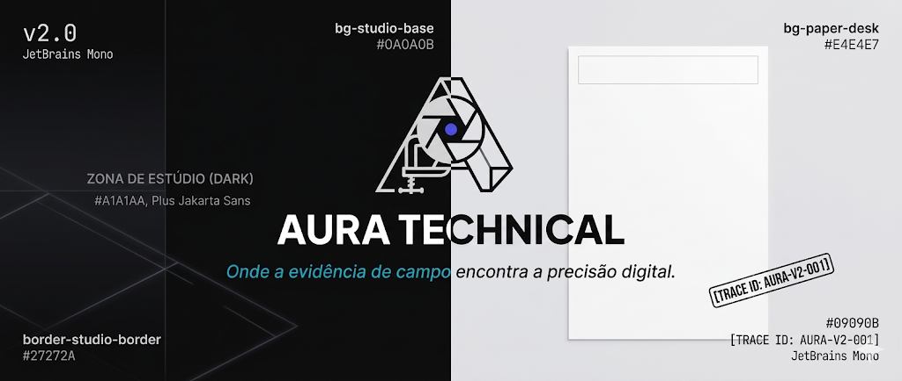

# 📋 Aura Technical: Gerador de Relatórios Fotográficos v2.0

<div align="center">

   

   [🚀 Live Demo](https://leonardoconstantino.github.io/Prompt-Manager/)

   
   
   
   
   
</div>


> Solução corporativa de alta performance para criação de laudos e relatórios de inspeção. Focada em agilidade, fidelidade visual e funcionamento offline total.

---

## 📌 Visão Geral

O **Aura Technical** é um "Estúdio de Evidências" projetado para técnicos e engenheiros que precisam registrar o estado de equipamentos com precisão. A interface divide o fluxo de trabalho em duas zonas físicas: o **Estúdio** (Painel de Edição Escuro) para entrada de dados e a **Mesa de Trabalho** (Preview Light) que emula fielmente o papel A4.

Diferente de geradores de PDF comuns, o Aura utiliza **unidades físicas reais (mm)** e um motor de compressão inteligente para garantir relatórios profissionais, leves e inalteráveis.

---

## ✨ Funcionalidades Profissionais

- **🚀 PWA Full Offline:** Instale como app no celular ou desktop. Capture fotos e gere relatórios mesmo em locais sem sinal de internet.
- **🎨 Design System "Studio":** Interface industrial de alto contraste baseada em Tailwind v4 e Web Components nativos.
- **📷 Inteligência de Imagem:**
  - **Compressão Automática:** Fotos de 10MB são otimizadas para <300KB via Canvas sem perda de detalhe técnico.
  - **Editor de Anotações:** Desenhe círculos e setas diretamente sobre as fotos para destacar falhas.
- **📑 Layout A4 Inteligente:**
  - **Detecção de Transbordo:** Avisa em tempo real se o conteúdo excedeu o limite da folha.
  - **Fidelidade 1:1:** O que você vê no preview é exatamente o que sai no PDF.
  - **Rastreabilidade:** Cada página recebe um `Trace ID` único e numeração automática.
- **🛡️ Segurança:** Sanitização de HTML automática para prevenir injeções e persistência robusta via **IndexedDB**.
- **↕️ Drag & Drop:** Reordene seções e evidências com feedback visual de posicionamento.

---

## 🏗️ Arquitetura Técnica

A aplicação segue uma arquitetura reativa e desacoplada:

- **State Management:** `AppStore` centralizado (Singleton) que gerencia o estado do relatório.
- **Comunicação:** `EventBus` tipado para sincronização entre componentes Editor e Preview.
- **Persistência:** `IndexedDBStorage` para salvamento automático granular.
- **UI:** Web Components nativos (Custom Elements v1) com encapsulamento de lógica e estilos Tailwind.

---

## 🚀 Começando

### Pré-requisitos
- [Node.js](https://nodejs.org/) (Versão 18 ou superior)

### Instalação e Execução
1. Clone o repositório:
   ```bash
   git clone https://github.com/leonardoconstantino/relatorio-fotografico.git
   ```
2. Instale as dependências:
   ```bash
   npm install
   ```
3. Inicie o ambiente de desenvolvimento:
   ```bash
   npm run dev
   ```
4. Gere a versão de produção (PWA):
   ```bash
   npm run build
   ```

---

## 🧩 Estrutura de Pastas

```text
src/
 ┣ components/
 ┃ ┣ layout/      # Estrutura macro (Editor, Preview, Layout)
 ┃ ┣ ui/          # Atómos (Botões, Inputs, Cards)
 ┃ ┗ features/    # Módulos complexos (ImageEditor, SortableList)
 ┣ libs/          # Bibliotecas core (EventBus, Logger, Storage)
 ┣ store/         # AppStore e lógica de estado
 ┣ types/         # Definições de interface TypeScript
 ┣ utils/         # Sanitização, processamento de imagem e canvas
 ┗ styles/        # CSS global e Tailwind v4 theme
```

---

## 🖨️ Exportação Profissional

Para obter 100% de fidelidade:
1. Use o botão **"🖨️ Gerar PDF Profissional"**.
2. No diálogo do navegador, selecione **Salvar como PDF**.
3. Em "Mais Definições", defina as **Margens como "Nenhuma"** (o Aura já provê margens técnicas de 20mm).
4. Ative **"Gráficos de Fundo"**.

---

## 📄 Licença

Este projeto está licenciado sob a **Licença MIT**.

---

<div align="center">
  Construído com precisão técnica para quem exige o melhor em campo.
</div>
